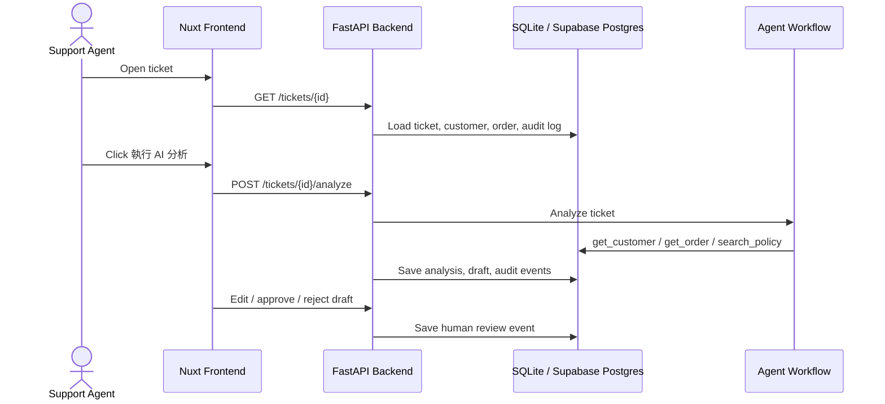
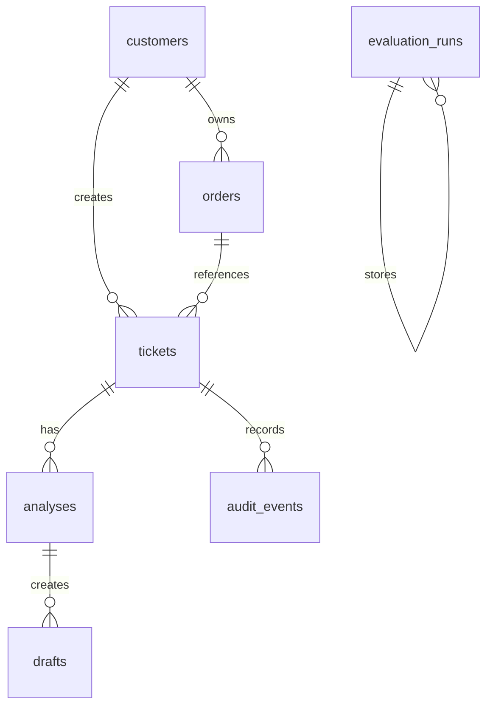

# Architecture

## Core Workflow

## Data Model

## Safety Boundary

The AI can recommend high-risk actions, but it cannot execute them directly.

Approval-required tools:

- `create_refund_request`
- `escalate_ticket`

In v1 these are recorded as pending tool calls. A future production version can connect them to real CRM, refund, or escalation APIs after manager approval.
