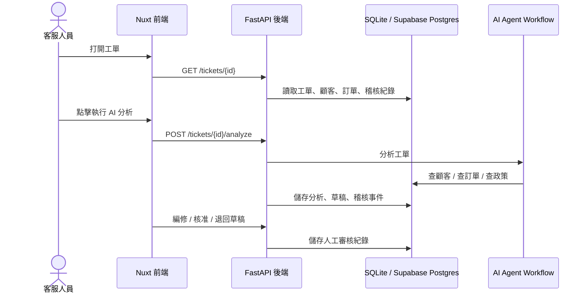
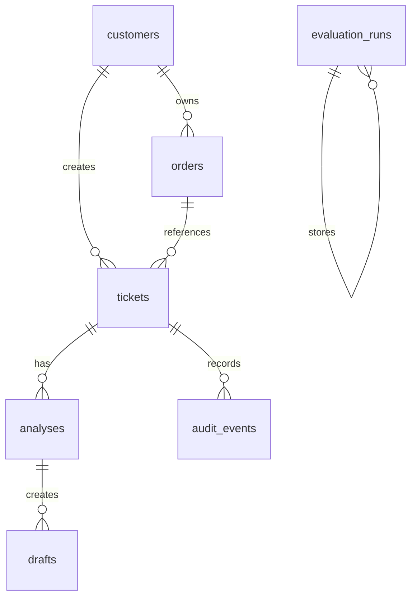

# 系統架構

## 核心流程



## 資料模型



主要資料表：

- `customers`：顧客基本資料與客服備註
- `orders`：訂單狀態、金額、品項與風險備註
- `tickets`：客服工單
- `analyses`：AI 結構化分析結果
- `drafts`：AI 回覆草稿與人工審核狀態
- `audit_events`：AI 與人工操作稽核紀錄
- `evaluation_runs`：評測報表

## AI Workflow

AI 分析一張工單時會輸出：

- 問題分類
- 優先級
- 顧客情緒
- 是否需要升級處理
- 案件摘要
- 工具呼叫紀錄
- 建議處理動作
- 回覆草稿
- 風險標記

目前沒有 `OPENAI_API_KEY` 時，系統會使用 deterministic demo agent，讓展示流程穩定且不產生模型費用。未來接上 OpenAI Responses API 後，可以把同一個 schema 換成真實 tool-calling workflow。

## 安全邊界

AI 可以建議高風險動作，但不能直接執行。

需要人工審核的工具：

- `create_refund_request`
- `escalate_ticket`

在 v1 中，這些動作只會被記錄成 pending tool call。未來產品化後，可以在人工或主管核准後，才串接真實 CRM、退款或升級 API。

## 部署邊界

本地開發：

```text
Nuxt dev server
        ↓
FastAPI
        ↓
SQLite
```

作品集部署：

```text
Vercel Nuxt 前端
        ↓
Render 或 Railway FastAPI 後端
        ↓
Supabase Postgres
```
